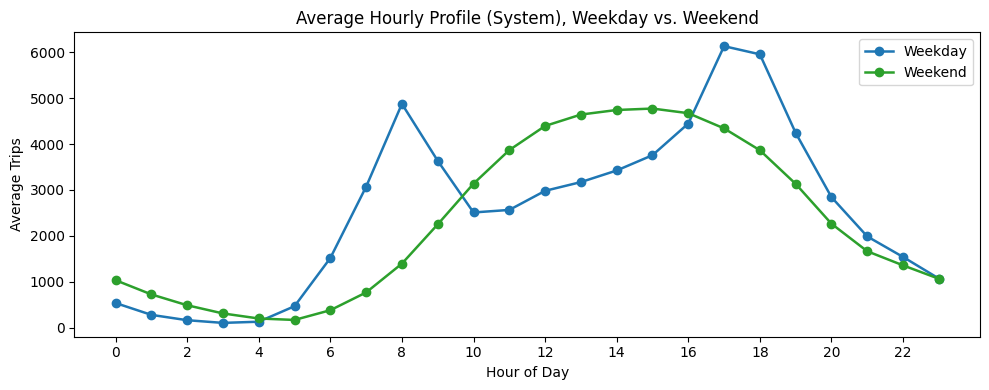
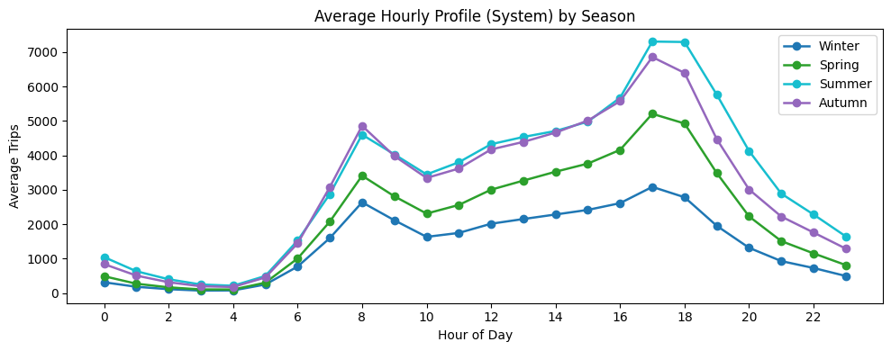
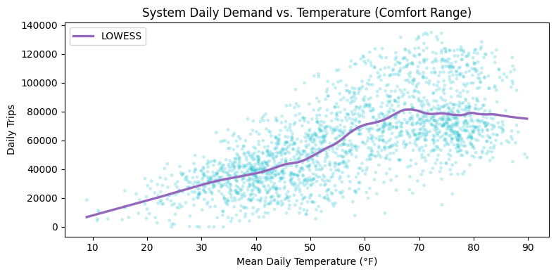
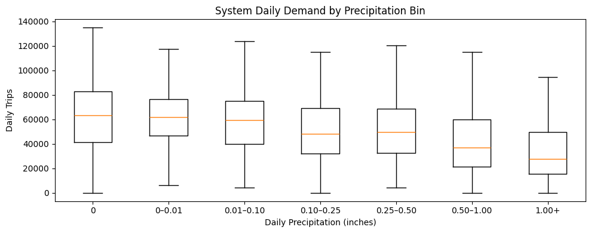
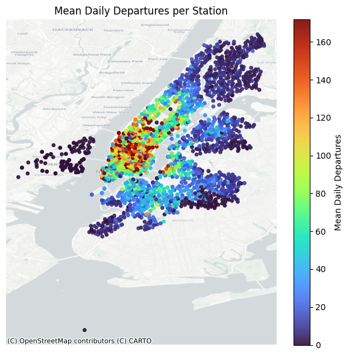
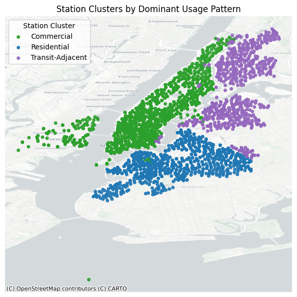

# Appendix B. Supplementary Exploratory Data Analysis Figures

*Figure B1 – Average hourly system demand by weekday and weekend.*

*Figure B2 – Average hourly system demand by season.*

*Figure B3 – System daily demand versus average daily temperature.*

*Figure B4 – System daily demand by precipitation intensity.*

*Figure B5 – Spatial distribution of mean daily departures per station.*

*Figure B6 – Station clusters by dominant usage pattern.*
