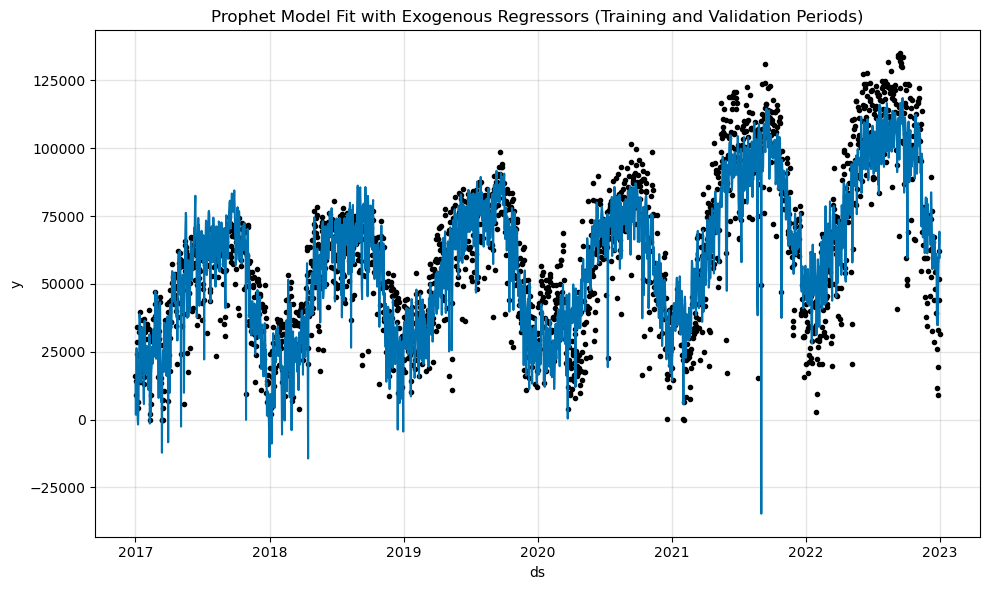
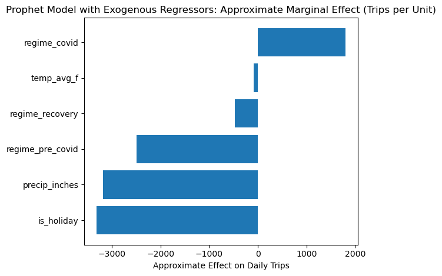
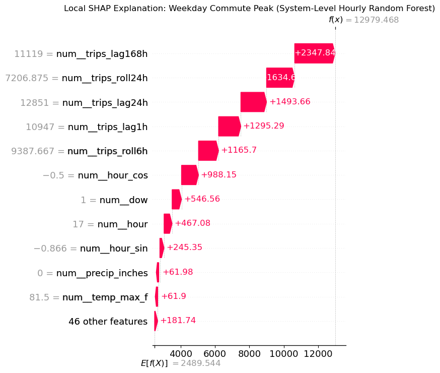
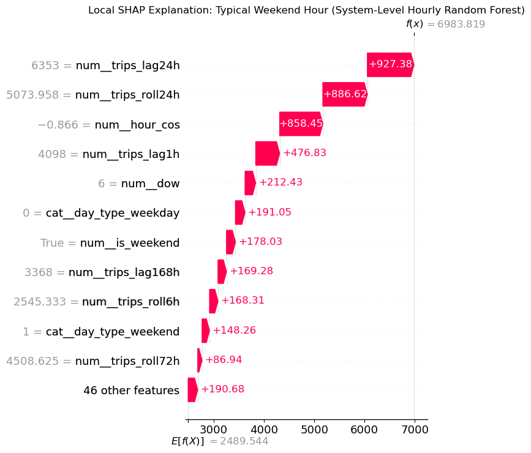

# Appendix F. Robustness and Interpretability Analyses for Comparative Model Performance

**Table FI. Global SHAP Feature Importance for the System-Level Hourly Random Forest**

| Feature          | Mean Abs SHAP |
| ---------------- | ------------: |
| hour_cos         |        872.90 |
| trips_lag1h      |        744.13 |
| trips_lag168h    |        736.71 |
| trips_lag24h     |        686.87 |
| trips_roll24h    |        463.19 |
| trips_roll6h     |        280.74 |
| hour             |        172.16 |
| hour_sin         |        143.69 |
| dow              |         75.26 |
| precip_inches    |         51.94 |
| temp_max_f       |         38.70 |
| trips_roll72h    |         34.27 |
| day_type_weekday |         19.54 |
| is_weekend       |         19.42 |
| day_type_weekend |         18.11 |
| year             |         14.88 |
| week_of_year     |         13.32 |
| trips_lag48h     |         11.40 |
| temp_dev_65_sq   |         11.28 |
| temp_min_f       |         10.70 |

*Author’s computations based on global SHAP analysis of the system-level hourly Random Forest forecasting model.*

**Table FII. Global SHAP Feature Importance for the Station-Level Random Forest**

| Feature                    | Mean Abs SHAP |
| -------------------------- | ------------: |
| departures_roll24h         |         0.598 |
| departures_lag168h         |         0.386 |
| hour_cos                   |         0.303 |
| departures_lag24h          |         0.244 |
| departures_roll6h          |         0.102 |
| departures_lag1h           |         0.054 |
| hour_sin                   |         0.050 |
| bike_count_nearest_counter |         0.042 |
| hour                       |         0.033 |
| precip_inches              |         0.028 |
| departures_roll72h         |         0.025 |
| lat                        |         0.015 |
| precip_roll7d              |         0.011 |
| dow                        |         0.011 |
| temp_dev_65_sq             |         0.009 |
| precip_roll3d              |         0.008 |
| is_weekend                 |         0.008 |
| wind_speed_mph             |         0.008 |
| pct_residential_mean       |         0.007 |
| aqi_citywide               |         0.007 |
| lng                        |         0.007 |
| temp_max_f                 |         0.007 |
| pct_commercial_mean        |         0.006 |
| acs_bachelors_density      |         0.006 |
| nearest_pluto_distance_m   |         0.006 |

*Author’s computations based on global SHAP analysis of the station-level Random Forest forecasting model.*

**Table FIII. Feature Group Ablation Results for the Station-Level Hourly CNN–LSTM**

| Group                              | RMSE |  MAE |    R² | Δ RMSE |  Δ MAE |   Δ R² |
| ---------------------------------- | ---: | ---: | ----: | -----: | -----: | -----: |
| Calendar & Time                    | 3.20 | 1.86 | 0.157 |  0.736 |  0.551 | -0.343 |
| Lag & Rolling Demand               | 2.57 | 1.40 | 0.459 |  0.099 |  0.083 | -0.041 |
| Weather                            | 2.53 | 1.35 | 0.475 |  0.061 |  0.036 | -0.025 |
| Demographics (ACS)                 | 2.48 | 1.32 | 0.495 |  0.011 |  0.002 | -0.004 |
| Location & Station Metadata        | 2.48 | 1.32 | 0.496 |  0.009 |  0.001 | -0.004 |
| Air Quality                        | 2.48 | 1.31 | 0.496 |  0.008 |  0.001 | -0.003 |
| Built Environment & Infrastructure | 2.47 | 1.31 | 0.501 | -0.003 | -0.001 |  0.001 |

*Author’s computations based on feature group ablation experiments for the station-level hourly CNN–LSTM model.*

**Table FIV. System-Level Hourly Forecast Performance by Demand Regime**

| Model   | Regime   |  RMSE |   MAE |    R² |
| ------- | -------- | ----: | ----: | ----: |
| RF      | Other    | 1,744 | 1,046 | 0.821 |
| RF      | Recovery |   903 |   548 | 0.921 |
| XGBoost | Other    | 2,001 | 1,287 | 0.764 |
| XGBoost | Recovery |   951 |   588 | 0.912 |

*Author’s computations based on system-level hourly regime-specific forecast evaluations.*

**Table FV. System-Level Daily Forecast Performance by Demand Regime**

| Model   | Regime   |   RMSE |    MAE |     R² |
| ------- | -------- | -----: | -----: | -----: |
| RF      | Other    | 47,154 | 40,392 | -0.128 |
| RF      | Recovery | 25,098 | 20,496 |  0.396 |
| XGBoost | Other    | 52,709 | 45,766 | -0.410 |
| XGBoost | Recovery | 26,812 | 21,727 |  0.311 |

*Author’s computations based on system-level daily regime-specific forecast evaluations.*

**Table FVI. System-Level Daily Forecast Performance of Classical Models by Demand Regime**

| Model          | Regime   |   RMSE |    MAE |    R² |
| -------------- | -------- | -----: | -----: | ----: |
| ETS + Exog     | Other    | 18,557 | 13,583 | 0.826 |
| ETS + Exog     | Recovery | 16,629 | 12,020 | 0.734 |
| SARIMAX + Exog | Other    | 15,920 | 11,589 | 0.872 |
| SARIMAX + Exog | Recovery | 14,526 | 10,158 | 0.797 |

*Author’s computations based on system-level daily regime-specific evaluations of classical forecasting models.*

**Table FVII. System-Level Daily Forecast Performance by Station-Type Cluster**

| Cluster Label    | Model          |   RMSE |    MAE |    R² |
| ---------------- | -------------- | -----: | -----: | ----: |
| Commercial       | ETS + Exog     | 41,260 | 35,228 | -1.54 |
| Commercial       | SARIMAX + Exog | 53,718 | 46,619 | -3.31 |
| Residential      | ETS + Exog     | 20,520 | 17,106 | -2.42 |
| Residential      | SARIMAX + Exog | 23,794 | 20,725 | -3.60 |
| Transit-Adjacent | ETS + Exog     |  9,589 |  8,234 | -3.96 |
| Transit-Adjacent | SARIMAX + Exog | 11,234 | 10,125 | -5.81 |

*Author’s computations based on system-level daily regime robustness evaluations stratified by station-type cluster.*

**Table FVIII. Sensitivity of System-Level Daily Forecast Performance to Feature-Group Removal by Station-Type Cluster**

| Cluster Label    | Specification | Model          |   RMSE |    MAE |    R² |
| ---------------- | ------------- | -------------- | -----: | -----: | ----: |
| Commercial       | Full          | ETS + Exog     | 41,260 | 35,228 | -1.54 |
| Commercial       | No Calendar   | ETS + Exog     | 41,506 | 35,510 | -1.57 |
| Commercial       | No Weather    | ETS + Exog     | 60,490 | 53,298 | -4.46 |
| Commercial       | Full          | SARIMAX + Exog | 53,718 | 46,619 | -3.31 |
| Commercial       | No Calendar   | SARIMAX + Exog | 56,168 | 49,141 | -3.71 |
| Commercial       | No Weather    | SARIMAX + Exog | 51,200 | 44,002 | -2.91 |
| Residential      | Full          | ETS + Exog     | 20,520 | 17,106 | -2.42 |
| Residential      | No Calendar   | ETS + Exog     | 20,574 | 17,163 | -2.44 |
| Residential      | No Weather    | ETS + Exog     | 26,265 | 22,614 | -4.61 |
| Residential      | Full          | SARIMAX + Exog | 23,794 | 20,725 | -3.60 |
| Residential      | No Calendar   | SARIMAX + Exog | 25,840 | 22,747 | -4.43 |
| Residential      | No Weather    | SARIMAX + Exog | 22,206 | 18,986 | -3.01 |
| Transit-Adjacent | Full          | ETS + Exog     |  9,589 |  8,234 | -3.96 |
| Transit-Adjacent | No Calendar   | ETS + Exog     |  9,596 |  8,241 | -3.97 |
| Transit-Adjacent | No Weather    | ETS + Exog     | 11,140 |  9,677 | -5.70 |
| Transit-Adjacent | Full          | SARIMAX + Exog | 11,234 | 10,125 | -5.81 |
| Transit-Adjacent | No Calendar   | SARIMAX + Exog | 10,445 |  9,326 | -4.89 |
| Transit-Adjacent | No Weather    | SARIMAX + Exog |  9,858 |  8,772 | -4.24 |

*Author’s computations based on feature-group removal experiments for system-level daily forecasts, stratified by station-type cluster.*

*Figure F1 – Prophet fit with exogenous variables using combined training and validation data.*

*Figure F2 – Approximate marginal effects of prophet exogenous regressors expressed as changes in daily trips.*

*Figure F3 – Local SHAP explanation for a weekday commute peak prediction from the system-level hourly Random Forest model.*

*Figure F4 – Local SHAP explanation for a weekend-hour prediction from the system-level hourly Random Forest model.*
